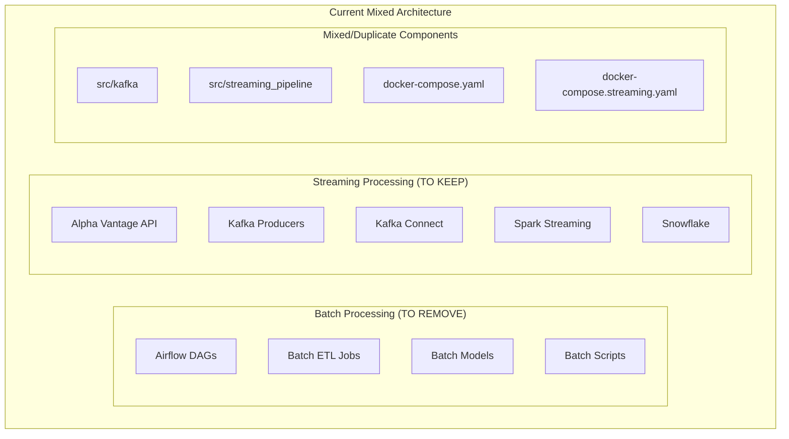
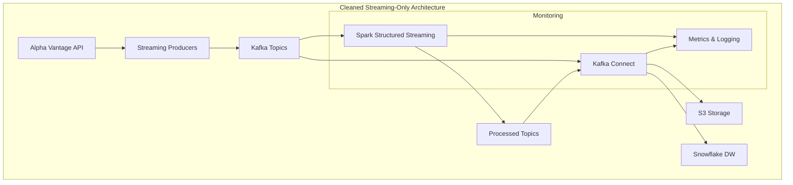

# Project Cleanup Design Document

## Overview

This document outlines the systematic approach to cleaning up the stock market data pipeline project by removing all batch processing components and focusing exclusively on streaming data processing. The cleanup will preserve the core streaming functionality while eliminating redundant, unused, and batch-specific code and infrastructure.

## Architecture

### Current State Analysis



### Target State Architecture



## Components and Interfaces

### 1. Directory Structure Cleanup

**Current Structure Issues:**
- Duplicate streaming implementations in `src/kafka` and `src/streaming_pipeline`
- Entire `src/batch` directory with unused batch processing code
- Mixed Docker configurations and environment files
- Airflow directory with batch scheduling infrastructure

**Target Structure:**
```
src/
├── streaming_pipeline/          # Consolidated streaming code
│   ├── clients/                # Alpha Vantage API client
│   ├── producers/              # Kafka producers
│   ├── processors/             # Spark streaming processors
│   ├── models/                 # Data models and schemas
│   ├── warehouse/              # Snowflake integration
│   ├── monitoring/             # Logging and metrics
│   ├── schemas/                # Avro schemas
│   └── config/                 # Configuration management
config/
├── kafka-connect/              # Kafka Connect configurations
├── logging.yaml               # Logging configuration
└── streaming_pipeline.env.template
docs/
├── streaming_pipeline_setup.md
├── avro_serialization_guide.md
└── docker_setup.md
scripts/
├── kafka-connect-manager.py
├── init-schema-registry.py
└── setup-docker.sh
```

### 2. Component Consolidation Strategy

**Kafka Components:**
- **Action:** Merge `src/kafka` into `src/streaming_pipeline`
- **Rationale:** `src/streaming_pipeline` has more complete implementation
- **Preserved:** Producer logic, configuration management
- **Removed:** Duplicate consumer implementations

**Docker Configuration:**
- **Action:** Keep `docker-compose.streaming.yaml` as primary
- **Rationale:** Focused on streaming services only
- **Preserved:** Kafka, Zookeeper, Schema Registry, Spark, Kafka Connect
- **Removed:** Airflow services, batch processing containers

**Environment Configuration:**
- **Action:** Consolidate to streaming-specific environment files
- **Preserved:** `config/.env.streaming.template`, `config/streaming_pipeline.env.template`
- **Removed:** Batch-specific environment variables and templates

### 3. File Removal Plan

#### High Priority Removals (Batch Processing)
```
REMOVE:
├── src/batch/                  # Entire batch processing directory
├── airflow/                    # Airflow DAGs and logs
├── src/airflow/               # Airflow source code
├── Dockerfile.airflow         # Airflow container
├── src/kafka/                 # Duplicate Kafka implementation
└── src/spark/jobs/            # Batch Spark jobs
```

#### Data and Cache Cleanup
```
REMOVE:
├── data/kafka/                # Kafka log files and data
├── data/zookeeper/           # Zookeeper data files
├── .pytest_cache/           # Python test cache
├── **/__pycache__/          # Python bytecode cache
├── airflow/logs/            # Airflow execution logs
└── **/.DS_Store            # macOS system files
```

#### Configuration Cleanup
```
REMOVE:
├── docker-compose.yaml       # Mixed batch/streaming compose
├── Makefile.streaming        # Keep streaming-docker version
├── config/env.template       # Keep streaming-specific templates
└── requirements.txt          # Keep requirements-streaming.txt
```

### 4. Code Consolidation Logic

**Alpha Vantage Client:**
- **Location:** `src/streaming_pipeline/clients/alpha_vantage.py`
- **Action:** Keep existing implementation (already well-developed)
- **Dependencies:** Preserve API rate limiting and error handling

**Kafka Producers:**
- **Source:** Merge best features from `src/kafka/producers/` and `src/streaming_pipeline/producers/`
- **Target:** `src/streaming_pipeline/producers/`
- **Preserved Features:** Avro serialization, error handling, configuration management

**Spark Processors:**
- **Location:** `src/streaming_pipeline/processors/`
- **Action:** Keep existing structured streaming implementation
- **Preserved:** Stream processing logic, data quality checks, dimensional modeling

**Monitoring and Logging:**
- **Location:** `src/streaming_pipeline/monitoring/`
- **Action:** Keep comprehensive monitoring implementation
- **Features:** Metrics collection, health checks, structured logging

### 5. Configuration Management

**Environment Variables Consolidation:**
```bash
# Streaming-focused environment variables
ALPHA_VANTAGE_API_KEY=
KAFKA_BOOTSTRAP_SERVERS=
SCHEMA_REGISTRY_URL=
SNOWFLAKE_ACCOUNT=
SNOWFLAKE_USER=
SNOWFLAKE_PASSWORD=
SNOWFLAKE_DATABASE=
SNOWFLAKE_SCHEMA=
SNOWFLAKE_WAREHOUSE=
AWS_ACCESS_KEY_ID=
AWS_SECRET_ACCESS_KEY=
S3_BUCKET_NAME=
```

**Docker Compose Simplification:**
- **Base:** `docker-compose.streaming.yaml`
- **Services:** Kafka, Zookeeper, Schema Registry, Kafka Connect, Spark
- **Removed:** Airflow, batch processing containers
- **Networks:** Simplified to streaming-only network topology

### 6. Documentation Updates

**Updated Documentation Structure:**
```
docs/
├── streaming_pipeline_setup.md    # Main setup guide
├── docker_setup.md               # Docker deployment
├── avro_serialization_guide.md   # Schema management
└── spark_optimization_guide.md   # Performance tuning
```

**Content Updates:**
- Remove all batch processing references
- Update architecture diagrams to show streaming-only flow
- Simplify setup instructions to focus on streaming components
- Update troubleshooting guides for streaming-specific issues

## Error Handling

### Cleanup Validation Strategy

1. **Dependency Analysis:**
   - Scan for cross-references between batch and streaming code
   - Identify shared utilities that need preservation
   - Validate import statements and module dependencies

2. **Configuration Validation:**
   - Ensure all streaming services can start with cleaned configuration
   - Validate environment variable completeness
   - Test Docker compose functionality

3. **Functional Testing:**
   - Verify Alpha Vantage API integration still works
   - Test Kafka producer/consumer functionality
   - Validate Spark streaming job execution
   - Confirm Snowflake data loading

### Rollback Strategy

1. **Git Branch Protection:**
   - Create cleanup branch before making changes
   - Maintain ability to rollback to previous state
   - Document all removed components for potential restoration

2. **Incremental Cleanup:**
   - Remove components in phases to identify issues early
   - Test functionality after each major removal
   - Maintain running system during cleanup process

## Testing Strategy

### Pre-Cleanup Testing
- Document current streaming pipeline functionality
- Create test cases for core streaming features
- Capture baseline performance metrics

### Post-Cleanup Validation
- **Unit Tests:** Verify individual component functionality
- **Integration Tests:** Test end-to-end streaming pipeline
- **Performance Tests:** Ensure no performance degradation
- **Configuration Tests:** Validate all environment configurations

### Test Scenarios
1. **Data Flow Test:** Alpha Vantage → Kafka → Spark → Snowflake
2. **Error Handling Test:** API failures, Kafka outages, processing errors
3. **Scaling Test:** Multiple producers, consumer groups, parallel processing
4. **Recovery Test:** Service restarts, data replay, checkpoint recovery

## Implementation Phases

### Phase 1: Analysis and Preparation
- Analyze current codebase dependencies
- Identify shared components between batch and streaming
- Create backup of current state
- Document current streaming functionality

### Phase 2: Batch Component Removal
- Remove `src/batch` directory
- Remove Airflow infrastructure
- Clean up batch-specific Docker configurations
- Remove batch processing documentation

### Phase 3: Code Consolidation
- Merge `src/kafka` into `src/streaming_pipeline`
- Consolidate Docker compose files
- Merge environment configuration files
- Update import statements and dependencies

### Phase 4: Data and Cache Cleanup
- Remove Kafka data files
- Clean up Python cache directories
- Remove Airflow logs and temporary files
- Update .gitignore for proper exclusions

### Phase 5: Documentation and Testing
- Update all documentation to reflect streaming-only architecture
- Run comprehensive testing suite
- Validate Docker deployment
- Performance testing and optimization

### Phase 6: Final Validation
- End-to-end pipeline testing
- Configuration validation
- Performance benchmarking
- Documentation review and updates