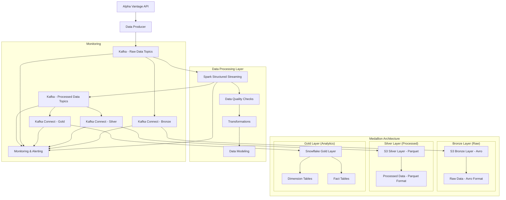

# Streaming Pipeline Design Document

## Overview

This document outlines the design for a real-time streaming data pipeline that ingests financial market data from Alpha Vantage API, processes it through Kafka and Spark Structured Streaming, and loads it into Snowflake using Snowpipe. The architecture emphasizes robust data modeling with dimensional design patterns to support efficient analytics and reporting.

## Architecture

### High-Level Architecture



### Component Architecture

1. **Data Ingestion Layer**
   - Alpha Vantage API client with rate limiting and retry logic
   - Kafka producer for real-time data streaming
   - Docker containerized for scalability

2. **Stream Processing Layer**
   - Spark Structured Streaming for real-time data processing
   - Data quality validation and cleansing
   - Real-time transformations and enrichments

3. **Storage Layer**
   - AWS S3 as intermediate storage and Snowpipe trigger
   - Snowflake data warehouse with dimensional model
   - Optimized for analytical workloads

## Components and Interfaces

### 1. Alpha Vantage Data Producer

**Purpose:** Ingests real-time stock market data from Alpha Vantage API

**Key Components:**
- `AlphaVantageClient`: API client with authentication and rate limiting
- `DataProducer`: Kafka producer for streaming data
- `ConfigManager`: Manages API keys, symbols, and intervals

**Interfaces:**
```python
class AlphaVantageClient:
    def get_real_time_quote(self, symbol: str) -> Dict
    def get_intraday_data(self, symbol: str, interval: str) -> Dict
    def handle_rate_limit(self) -> None

class DataProducer:
    def publish_to_kafka(self, topic: str, data: Dict) -> None
    def serialize_message(self, data: Dict) -> bytes
```

### 2. Kafka Streaming Infrastructure

**Purpose:** Provides reliable, scalable message streaming between components and serves as the central data delivery hub

**Raw Data Topics:**
- `stock-quotes-realtime`: Real-time stock quotes from API
- `stock-intraday-data`: Intraday price data from API
- `market-events`: Market open/close events

**Processed Data Topics:**
- `processed-stock-prices`: Transformed stock price data ready for warehouse
- `processed-trading-volume`: Processed trading volume data
- `processed-technical-indicators`: Calculated technical indicators
- `data-quality-alerts`: Data quality validation results

**Configuration:**
- Partitioning by stock symbol for parallel processing
- Replication factor of 3 for fault tolerance
- Retention period of 7 days for replay capability
- Compaction enabled for dimension data topics

### 3. Spark Structured Streaming Processor

**Purpose:** Real-time data processing, transformation, and quality validation

**Key Components:**
- `StreamProcessor`: Main processing engine
- `DataQualityValidator`: Validates incoming data
- `DataTransformer`: Applies business logic and enrichments
- `DimensionalModelBuilder`: Constructs dimensional model data

**Processing Logic:**
```python
class StreamProcessor:
    def process_stock_stream(self) -> None
    def apply_watermarking(self, df: DataFrame) -> DataFrame
    def calculate_technical_indicators(self, df: DataFrame) -> DataFrame
    def prepare_dimensional_data(self, df: DataFrame) -> Tuple[DataFrame, DataFrame]
    def publish_to_kafka(self, topic: str, df: DataFrame) -> None
    def write_to_output_topics(self, processed_data: Dict[str, DataFrame]) -> None
```

### 4. Data Quality Framework

**Purpose:** Ensures data integrity and consistency throughout the pipeline

**Validation Rules:**
- Price validation (positive values, reasonable ranges)
- Volume validation (non-negative, outlier detection)
- Timestamp validation (chronological order, timezone consistency)
- Symbol validation (against master list)
- Completeness checks (required fields present)

### 5. Kafka Connect Data Delivery (Medallion Architecture)

**Purpose:** Implements medallion architecture with Bronze, Silver, and Gold layers using Kafka Connect for reliable data delivery

**Bronze Layer Connector (Raw Data Storage):**
- **S3 Sink Connector**: Stores raw data from Kafka in Avro format
- **Topics**: `stock-quotes-realtime`, `stock-intraday-data`
- **Format**: Avro (schema evolution support)
- **Partitioning**: By symbol and date for optimal organization

**Silver Layer Connector (Processed Data Storage):**
- **S3 Sink Connector**: Stores processed data in Parquet format
- **Topics**: `processed-stock-prices`, `processed-trading-volume`
- **Format**: Parquet (optimized for analytics)
- **Partitioning**: By symbol and date for query performance

**Gold Layer Connector (Analytics Data):**
- **Snowflake Sink Connector**: Streams dimensional data to Snowflake
- **Topics**: `processed-stock-prices`, `processed-trading-volume`
- **Target**: Dimensional model tables (facts and dimensions)
- **Buffer**: Optimized for real-time analytics

**Configuration:**
```json
{
  "bronze_s3_connector": {
    "topics": "stock-quotes-realtime,stock-intraday-data",
    "format": "avro",
    "partitioning": "symbol,date",
    "s3_path": "s3://data-lake/bronze/stock-data/",
    "flush_size": 1000
  },
  "silver_s3_connector": {
    "topics": "processed-stock-prices,processed-trading-volume",
    "format": "parquet",
    "partitioning": "symbol,date",
    "s3_path": "s3://data-lake/silver/stock-data/",
    "flush_size": 1000
  },
  "gold_snowflake_connector": {
    "topics": "processed-stock-prices,processed-trading-volume",
    "buffer_count_records": 10000,
    "buffer_size_bytes": 5000000
  }
}
```

### 6. Snowflake Data Warehouse

**Purpose:** Analytical data store with optimized dimensional model

**Connection Management:**
- Kafka Connect Snowflake connector for streaming ingestion
- Connection pooling and retry logic
- Secure credential management

## Data Models

### Dimensional Model Design

#### Dimension Tables

**1. dim_company**
```sql
CREATE TABLE dim_company (
    company_key NUMBER AUTOINCREMENT PRIMARY KEY,
    symbol VARCHAR(10) NOT NULL,
    company_name VARCHAR(255),
    sector VARCHAR(100),
    industry VARCHAR(100),
    market_cap_category VARCHAR(20),
    exchange VARCHAR(10),
    currency VARCHAR(3),
    country VARCHAR(50),
    effective_date DATE NOT NULL,
    expiry_date DATE,
    is_current BOOLEAN DEFAULT TRUE,
    created_at TIMESTAMP_NTZ DEFAULT CURRENT_TIMESTAMP(),
    updated_at TIMESTAMP_NTZ DEFAULT CURRENT_TIMESTAMP()
);
```

**2. dim_date**
```sql
CREATE TABLE dim_date (
    date_key NUMBER PRIMARY KEY,
    date_value DATE NOT NULL,
    year NUMBER,
    quarter NUMBER,
    month NUMBER,
    month_name VARCHAR(20),
    day_of_month NUMBER,
    day_of_week NUMBER,
    day_name VARCHAR(20),
    week_of_year NUMBER,
    is_weekend BOOLEAN,
    is_holiday BOOLEAN,
    fiscal_year NUMBER,
    fiscal_quarter NUMBER
);
```

**3. dim_time**
```sql
CREATE TABLE dim_time (
    time_key NUMBER PRIMARY KEY,
    time_value TIME NOT NULL,
    hour NUMBER,
    minute NUMBER,
    second NUMBER,
    hour_minute VARCHAR(5),
    am_pm VARCHAR(2),
    market_session VARCHAR(20), -- 'PRE_MARKET', 'REGULAR', 'AFTER_HOURS'
    trading_day_minute NUMBER -- Minutes since market open
);
```

#### Fact Tables

**1. fact_stock_prices**
```sql
CREATE TABLE fact_stock_prices (
    price_key NUMBER AUTOINCREMENT PRIMARY KEY,
    company_key NUMBER NOT NULL,
    date_key NUMBER NOT NULL,
    time_key NUMBER NOT NULL,
    open_price DECIMAL(18,4),
    high_price DECIMAL(18,4),
    low_price DECIMAL(18,4),
    close_price DECIMAL(18,4),
    volume NUMBER,
    adjusted_close DECIMAL(18,4),
    dividend_amount DECIMAL(18,4),
    split_coefficient DECIMAL(10,6),
    
    -- Technical Indicators
    sma_20 DECIMAL(18,4),
    sma_50 DECIMAL(18,4),
    ema_12 DECIMAL(18,4),
    ema_26 DECIMAL(18,4),
    rsi_14 DECIMAL(8,4),
    macd DECIMAL(18,4),
    macd_signal DECIMAL(18,4),
    
    -- Metadata
    data_source VARCHAR(50),
    ingestion_timestamp TIMESTAMP_NTZ,
    processing_timestamp TIMESTAMP_NTZ DEFAULT CURRENT_TIMESTAMP(),
    
    FOREIGN KEY (company_key) REFERENCES dim_company(company_key),
    FOREIGN KEY (date_key) REFERENCES dim_date(date_key),
    FOREIGN KEY (time_key) REFERENCES dim_time(time_key)
);
```

**2. fact_trading_volume**
```sql
CREATE TABLE fact_trading_volume (
    volume_key NUMBER AUTOINCREMENT PRIMARY KEY,
    company_key NUMBER NOT NULL,
    date_key NUMBER NOT NULL,
    time_key NUMBER NOT NULL,
    volume NUMBER NOT NULL,
    volume_weighted_price DECIMAL(18,4),
    trade_count NUMBER,
    buy_volume NUMBER,
    sell_volume NUMBER,
    
    -- Volume Indicators
    volume_sma_20 NUMBER,
    volume_ratio DECIMAL(8,4), -- Current volume / Average volume
    
    -- Metadata
    data_source VARCHAR(50),
    ingestion_timestamp TIMESTAMP_NTZ,
    processing_timestamp TIMESTAMP_NTZ DEFAULT CURRENT_TIMESTAMP(),
    
    FOREIGN KEY (company_key) REFERENCES dim_company(company_key),
    FOREIGN KEY (date_key) REFERENCES dim_date(date_key),
    FOREIGN KEY (time_key) REFERENCES dim_time(time_key)
);
```

### Partitioning and Clustering Strategy

**Partitioning:**
- Partition fact tables by `date_key` for optimal time-based queries
- Use monthly partitions for balance between query performance and maintenance

**Clustering:**
- Cluster fact tables on `(company_key, date_key, time_key)` for optimal query performance
- Cluster dimension tables on natural keys and frequently queried columns

**Indexing:**
- Create indexes on foreign key relationships
- Index frequently filtered columns in dimension tables

## Error Handling

### Data Quality Error Handling

1. **Validation Failures:**
   - Quarantine invalid records in separate error tables
   - Log detailed validation failure reasons
   - Send alerts for high error rates

2. **Schema Evolution:**
   - Implement schema registry for Kafka topics
   - Handle backward-compatible schema changes automatically
   - Alert on breaking schema changes

3. **Processing Failures:**
   - Implement checkpointing in Spark Structured Streaming
   - Use dead letter queues for unprocessable messages
   - Automatic retry with exponential backoff

### Infrastructure Error Handling

1. **API Rate Limiting:**
   - Implement exponential backoff with jitter
   - Queue requests during rate limit periods
   - Monitor and alert on quota usage

2. **Kafka Failures:**
   - Producer retry configuration with idempotency
   - Consumer group rebalancing handling
   - Topic partition failure recovery

3. **Snowflake Loading Failures:**
   - Snowpipe error monitoring and alerting
   - File format validation before loading
   - Automatic retry for transient failures

## Testing Strategy

### Unit Testing
- Test individual components (API client, data transformations, validators)
- Mock external dependencies (Alpha Vantage API, Kafka, Snowflake)
- Validate data transformation logic and business rules

### Integration Testing
- End-to-end pipeline testing with test data
- Kafka producer-consumer integration tests
- Snowflake loading and query validation tests

### Performance Testing
- Load testing with high-volume data streams
- Latency testing for real-time processing requirements
- Scalability testing for horizontal scaling scenarios

### Data Quality Testing
- Validate dimensional model integrity
- Test slowly changing dimension logic
- Verify fact table aggregations and calculations

## Monitoring and Observability

### Key Metrics
- **Throughput:** Messages per second processed
- **Latency:** End-to-end processing time
- **Error Rates:** Failed messages, API errors, validation failures
- **Data Quality:** Completeness, accuracy, consistency metrics
- **Resource Utilization:** CPU, memory, disk usage

### Alerting
- Critical: Pipeline failures, data quality issues
- Warning: High latency, approaching rate limits
- Info: Successful batch completions, scaling events

### Logging
- Structured logging with correlation IDs
- Centralized log aggregation (ELK stack or similar)
- Log retention policies for compliance and debugging