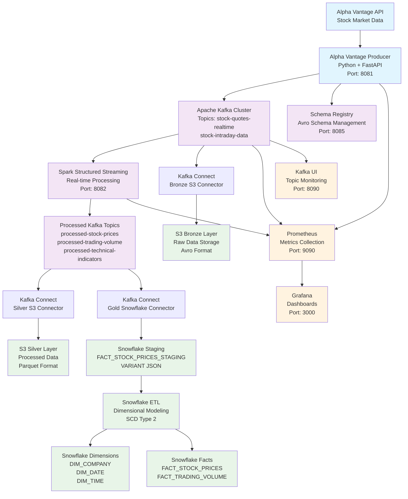
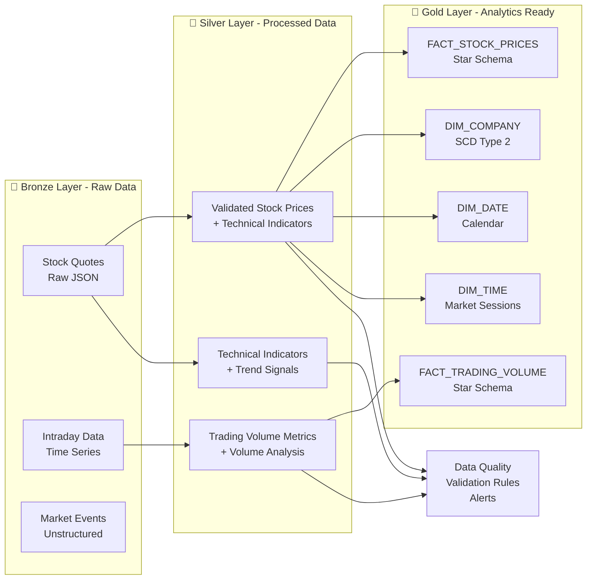
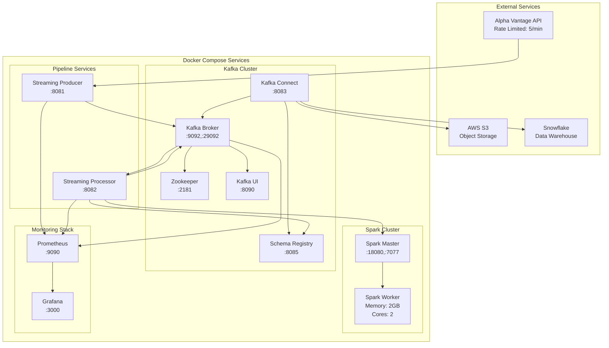
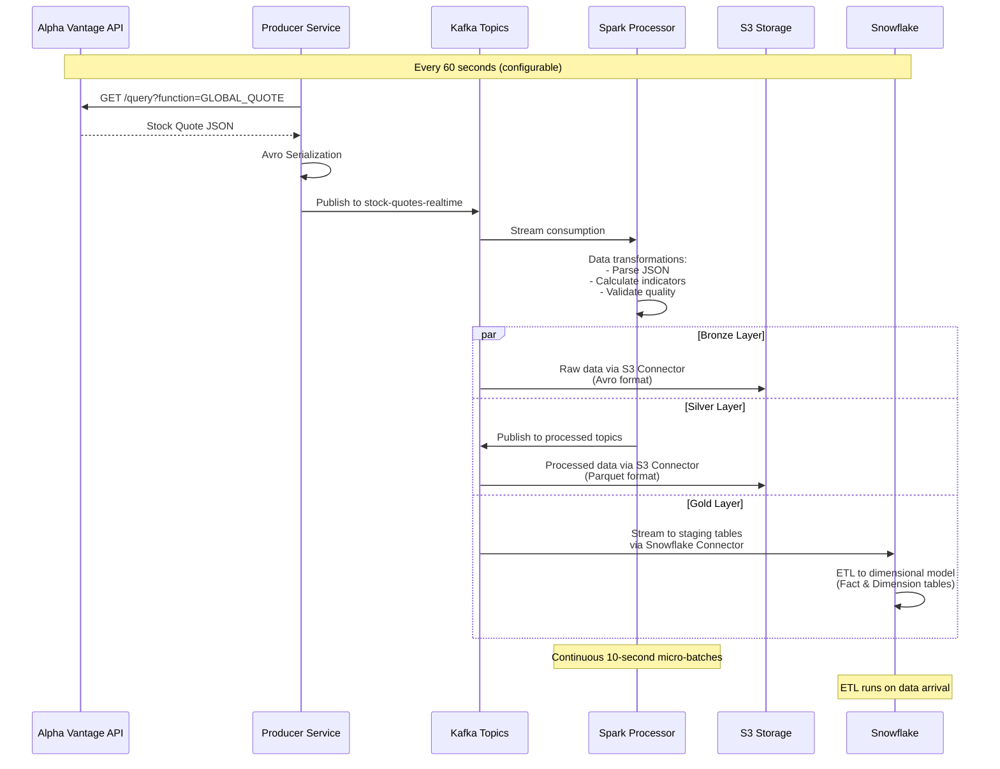
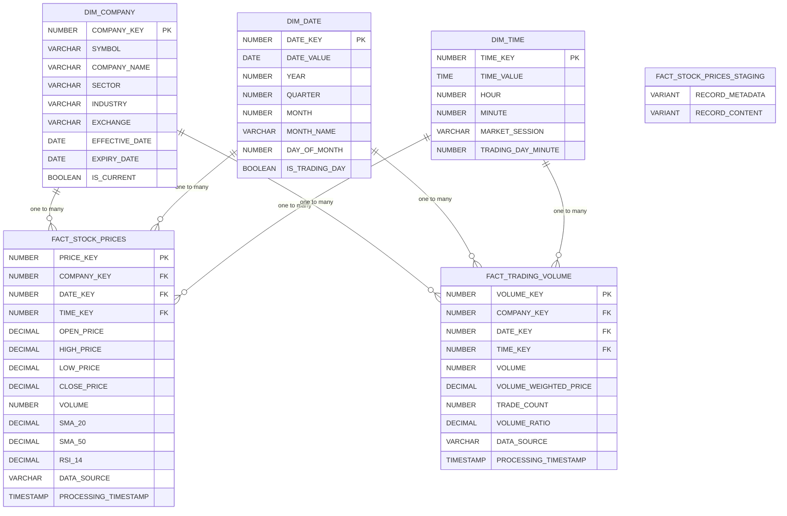
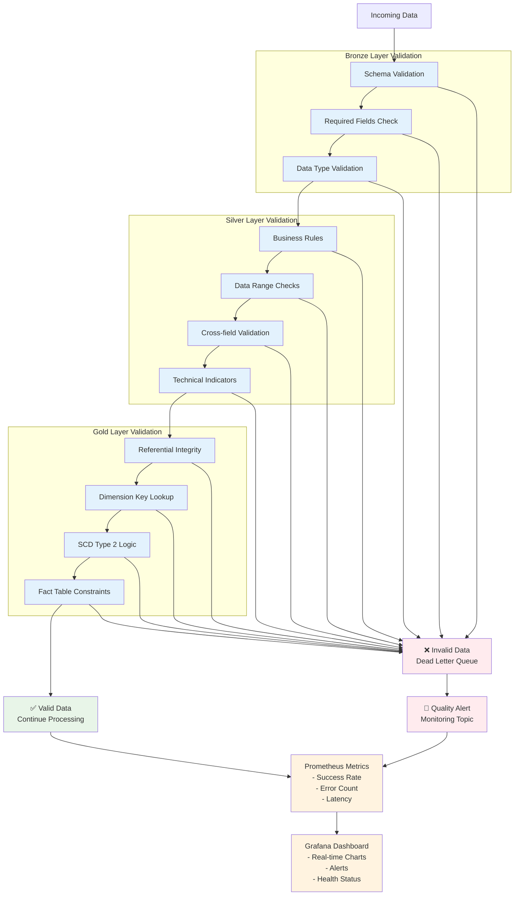
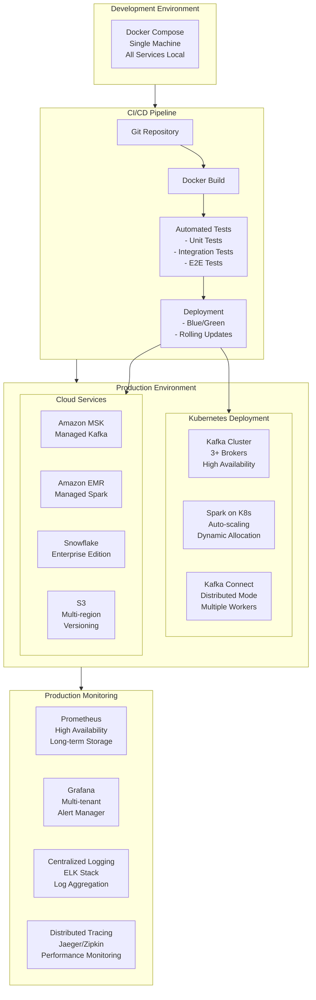

# System Flow Diagrams - Stock Market Streaming Pipeline

## 🔄 Complete Data Flow Architecture

## 📊 Medallion Architecture Flow

## 🔧 Component Interaction Diagram

## 📈 Real-time Processing Flow

## 🏗️ Snowflake Dimensional Model

## 🎯 Data Quality & Monitoring Flow

## 🚀 Deployment & Scaling Architecture

This comprehensive set of diagrams provides a complete visual understanding of your stock market streaming pipeline architecture, from high-level data flow to detailed component interactions and production deployment considerations.