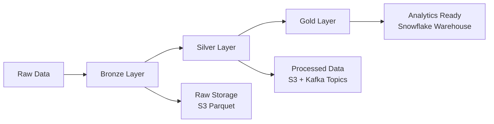
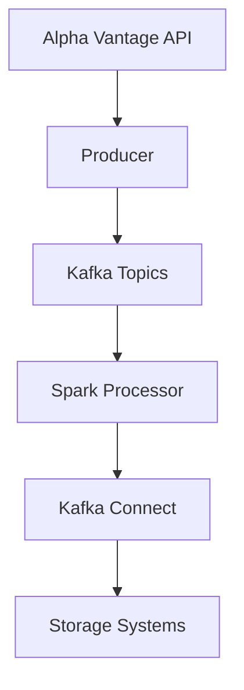

# Stock Market Streaming Pipeline - Complete Beginner's Guide

## 📋 Table of Contents
1. [System Overview](#system-overview)
2. [Architecture Patterns](#architecture-patterns)
3. [Technology Stack](#technology-stack)
4. [Data Flow Walkthrough](#data-flow-walkthrough)
5. [Components Deep Dive](#components-deep-dive)
6. [Best Practices Implemented](#best-practices-implemented)
7. [Setup and Running](#setup-and-running)

## 🔍 System Overview

### What This System Does
This is a **real-time stock market data streaming pipeline** that:
- Fetches live stock data from Alpha Vantage API
- Processes data in real-time using Apache Spark
- Stores data in multiple formats (S3, Snowflake)
- Provides analytics-ready dimensional data model
- Monitors data quality and system health

### Target Audience
- **Data Engineers** - Building streaming pipelines
- **Financial Analysts** - Real-time market analysis
- **DevOps Teams** - Pipeline monitoring and maintenance

## 🏗️ Architecture Patterns

### 1. Medallion Architecture (Bronze → Silver → Gold)


**Bronze Layer**: Raw, unprocessed data
**Silver Layer**: Cleaned, validated, transformed data
**Gold Layer**: Business-ready, dimensional model

### 2. Event-Driven Architecture


### 3. Microservices Pattern
- Each component runs in isolated Docker containers
- Independent scaling and deployment
- Health checks and monitoring per service

## 🛠️ Technology Stack

### Core Technologies
| Component | Technology | Version | Purpose |
|-----------|------------|---------|---------|
| **Message Broker** | Apache Kafka | 7.6.0 | Real-time data streaming |
| **Stream Processing** | Apache Spark | 3.4.1 | Data transformation |
| **Schema Management** | Schema Registry | 7.6.0 | Avro schema evolution |
| **Data Integration** | Kafka Connect | 7.6.0 | Connector framework |
| **Data Warehouse** | Snowflake | Latest | Analytics & reporting |
| **Object Storage** | AWS S3 | Latest | Data lake storage |
| **Monitoring** | Prometheus + Grafana | Latest | Metrics & dashboards |
| **Orchestration** | Docker Compose | Latest | Container management |

### Programming Languages & Frameworks
- **Python 3.9+** - Main development language
- **PySpark** - Distributed data processing
- **FastAPI** - Health check endpoints
- **Confluent Kafka** - Python Kafka client

## 📊 Data Flow Walkthrough

### Step-by-Step Data Journey

#### 1. Data Ingestion (Producer Layer)
```python
# File: src/streaming_pipeline/producers/alpha_vantage_producer.py
# What happens:
Alpha Vantage API → Python Producer → Kafka Topics
```

**Process:**
1. **API Client** fetches stock quotes every 60 seconds
2. **Rate Limiting** respects API limits (5 calls/minute)
3. **Avro Serialization** converts data to schema-managed format
4. **Kafka Publishing** sends to `stock-quotes-realtime` topic

#### 2. Stream Processing (Silver Layer)
```python
# File: src/streaming_pipeline/processors/spark_processor.py
# What happens:
Kafka Topics → Spark Streaming → Processed Topics
```

**Transformations Applied:**
- **Data Validation** - Check required fields
- **Price Calculations** - Moving averages, volatility
- **Technical Indicators** - SMA, trend analysis
- **Session Classification** - Market hours detection

#### 3. Data Storage (Bronze/Silver/Gold Layers)

##### Bronze Layer (Raw Data)
```json
// Kafka Connect S3 Sink
{
  "connector": "bronze-s3-sink-connector",
  "format": "Avro",
  "destination": "s3://bucket/bronze/streaming-data/"
}
```

##### Silver Layer (Processed Data)
```json
// Processed Kafka Topics
{
  "topics": [
    "processed-stock-prices",
    "processed-trading-volume", 
    "processed-technical-indicators"
  ]
}
```

##### Gold Layer (Analytics Ready)
```sql
-- Snowflake Dimensional Model
FACT_STOCK_PRICES → DIM_COMPANY, DIM_DATE, DIM_TIME
FACT_TRADING_VOLUME → DIM_COMPANY, DIM_DATE, DIM_TIME
```

## 🔧 Components Deep Dive

### 1. Alpha Vantage Producer
**File**: `src/streaming_pipeline/producers/alpha_vantage_producer.py`

**Key Features:**
- **Health Checks** - HTTP endpoint for monitoring
- **Rate Limiting** - Respects API quotas
- **Error Handling** - Retry with exponential backoff
- **Avro Serialization** - Schema-managed data format

**Configuration:**
```bash
ALPHA_VANTAGE_API_KEY=your_key
PRODUCTION_INTERVAL_SECONDS=60
STOCK_SYMBOLS=AAPL,GOOGL,MSFT,AMZN,TSLA
```

### 2. Spark Stream Processor
**File**: `src/streaming_pipeline/processors/spark_processor.py`

**Processing Pipeline:**
1. **Kafka Stream Creation** - Subscribe to input topics
2. **Message Parsing** - JSON to structured data
3. **Data Transformations** - Business logic application
4. **Quality Validation** - Data validation rules
5. **Multi-Topic Publishing** - Output to processed topics

**Key Transformations:**
```python
# Moving Averages
.withColumn("sma_5min", F.avg("current_price").over(window_5min))
.withColumn("sma_20min", F.avg("current_price").over(window_20min))

# Volatility Calculation
.withColumn("price_volatility", 
    (F.col("high_price") - F.col("low_price")) / F.col("current_price") * 100)

# Trading Session Detection
.withColumn("trading_session",
    F.when(F.hour("processing_timestamp").between(9, 16), "regular")
     .when(F.hour("processing_timestamp").between(4, 9), "pre_market")
     .otherwise("after_hours"))
```

### 3. Kafka Connect Integration

#### Bronze S3 Connector
```json
{
  "connector.class": "io.confluent.connect.s3.S3SinkConnector",
  "topics": "stock-quotes-realtime,stock-intraday-data",
  "format.class": "io.confluent.connect.s3.format.avro.AvroFormat",
  "partitioner.class": "TimeBasedPartitioner",
  "flush.size": "1000",
  "rotate.interval.ms": "30000"
}
```

#### Gold Snowflake Connector
```json
{
  "connector.class": "com.snowflake.kafka.connector.SnowflakeSinkConnector",
  "topics": "processed-stock-prices,processed-trading-volume,processed-technical-indicators",
  "snowflake.topic2table.map": "processed-stock-prices:FACT_STOCK_PRICES_STAGING"
}
```

### 4. Snowflake Dimensional Model

#### Staging Tables (Kafka Connect Target)
```sql
-- Auto-created by Kafka Connect
CREATE TABLE FACT_STOCK_PRICES_STAGING (
    RECORD_METADATA VARIANT,  -- Kafka metadata
    RECORD_CONTENT VARIANT    -- JSON data from Spark
);
```

#### Dimension Tables
```sql
-- Company dimension with SCD Type 2
CREATE TABLE DIM_COMPANY (
    COMPANY_KEY NUMBER AUTOINCREMENT PRIMARY KEY,
    SYMBOL VARCHAR(10) NOT NULL,
    COMPANY_NAME VARCHAR(255),
    SECTOR VARCHAR(100),
    EFFECTIVE_DATE DATE NOT NULL,
    EXPIRY_DATE DATE,
    IS_CURRENT BOOLEAN DEFAULT TRUE
);

-- Date dimension
CREATE TABLE DIM_DATE (
    DATE_KEY NUMBER PRIMARY KEY,  -- YYYYMMDD format
    DATE_VALUE DATE NOT NULL,
    YEAR NUMBER,
    QUARTER NUMBER,
    MONTH NUMBER,
    IS_TRADING_DAY BOOLEAN
);

-- Time dimension  
CREATE TABLE DIM_TIME (
    TIME_KEY NUMBER PRIMARY KEY,  -- HHMM format
    TIME_VALUE TIME NOT NULL,
    HOUR NUMBER,
    MINUTE NUMBER,
    MARKET_SESSION VARCHAR(20)    -- REGULAR, PRE_MARKET, AFTER_HOURS
);
```

#### Fact Tables
```sql
-- Stock prices fact table
CREATE TABLE FACT_STOCK_PRICES (
    PRICE_KEY NUMBER AUTOINCREMENT PRIMARY KEY,
    COMPANY_KEY NUMBER NOT NULL,
    DATE_KEY NUMBER NOT NULL,
    TIME_KEY NUMBER NOT NULL,
    OPEN_PRICE DECIMAL(18,4),
    HIGH_PRICE DECIMAL(18,4),
    LOW_PRICE DECIMAL(18,4),
    CLOSE_PRICE DECIMAL(18,4),
    VOLUME NUMBER,
    -- Technical Indicators
    SMA_20 DECIMAL(18,4),
    SMA_50 DECIMAL(18,4),
    RSI_14 DECIMAL(8,4),
    MACD DECIMAL(18,4),
    -- Metadata
    DATA_SOURCE VARCHAR(50),
    PROCESSING_TIMESTAMP TIMESTAMP_NTZ
);
```

### 5. ETL Orchestration (MIGRATED TO SNOWFLAKE-NATIVE)
**Previous File**: `src/streaming_pipeline/warehouse/snowflake_dimensional_etl.py` (REMOVED - moved to deprecated/)
**New System**: Snowflake Tasks, Streams, and Stored Procedures

**Snowflake-Native ETL Process:**
1. **Data Extraction** - Parse JSON from staging tables
2. **Data Transformation** - Apply dimensional modeling
3. **Dimension Key Lookup** - Join with dimension tables
4. **Data Loading** - Insert into fact/dimension tables
5. **SCD Type 2 Processing** - Handle slowly changing dimensions

### 6. Monitoring & Health Checks
**File**: `src/streaming_pipeline/monitoring/health_checks.py`

**Health Check Components:**
- **Kafka Connect Status** - Connector health monitoring
- **Data Quality Metrics** - Validation rule results
- **System Dependencies** - External service availability
- **Pipeline Metrics** - Throughput and latency tracking

## 🎯 Best Practices Implemented

### 1. Data Quality & Validation
- **Schema Registry** - Enforces data contracts
- **Data Quality Rules** - Validation at each layer
- **Dead Letter Queues** - Handle malformed data
- **Data Quality Alerts** - Automated issue detection

### 2. Error Handling & Resilience
- **Retry Logic** - Exponential backoff for failures
- **Circuit Breakers** - Prevent cascade failures
- **Health Checks** - Proactive issue detection
- **Graceful Degradation** - Partial functionality during issues

### 3. Performance Optimization
- **Partitioning** - Kafka topics by symbol
- **Clustering** - Snowflake tables by query patterns
- **Caching** - Reduce repeated API calls
- **Batch Processing** - Optimize throughput

### 4. Security
- **API Key Management** - Environment variables
- **TLS Encryption** - Secure data transmission
- **Access Controls** - Role-based permissions
- **Audit Logging** - Track data access

### 5. Operational Excellence
- **Infrastructure as Code** - Docker Compose
- **Configuration Management** - Environment-based configs
- **Monitoring & Alerting** - Prometheus + Grafana
- **Documentation** - Comprehensive README files

## 🚀 Setup and Running

### Prerequisites
```bash
# Required tools
Docker & Docker Compose
Python 3.9+
Make

# Environment variables
ALPHA_VANTAGE_API_KEY=your_api_key
SNOWFLAKE_ACCOUNT=your_account
AWS_ACCESS_KEY_ID=your_aws_key
```

### Quick Start
```bash
# 1. Build services
make docker-build

# 2. Start pipeline
make docker-up

# 3. Check health
curl http://localhost:8081/health  # Producer
curl http://localhost:8082/health  # Processor

# 4. Monitor progress
# Kafka UI: http://localhost:8090
# Grafana: http://localhost:3000 (admin/admin)
# Prometheus: http://localhost:9090
```

### Monitoring Dashboards
- **Kafka UI** (localhost:8090) - Topic monitoring, message inspection
- **Grafana** (localhost:3000) - System metrics, custom dashboards
- **Prometheus** (localhost:9090) - Raw metrics collection

## 📈 Advanced Concepts

### Schema Evolution
The system supports backward-compatible schema changes through:
- **Schema Registry** - Version management
- **Avro Format** - Built-in evolution support
- **Kafka Connect** - Automatic schema detection

### Fault Tolerance
- **Kafka Replication** - Data durability
- **Spark Checkpointing** - Exactly-once processing
- **Dead Letter Queues** - Error data capture
- **Health Monitoring** - Automatic recovery

### Scalability Patterns
- **Horizontal Scaling** - Add more Kafka partitions
- **Vertical Scaling** - Increase Spark resources
- **Auto-scaling** - Based on data volume
- **Load Balancing** - Distribute processing load

This comprehensive architecture provides a production-ready foundation for real-time financial data processing with enterprise-grade reliability, scalability, and maintainability.